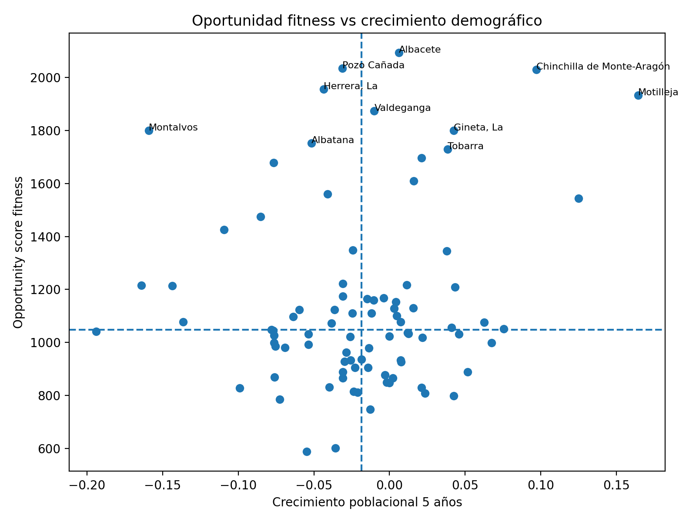
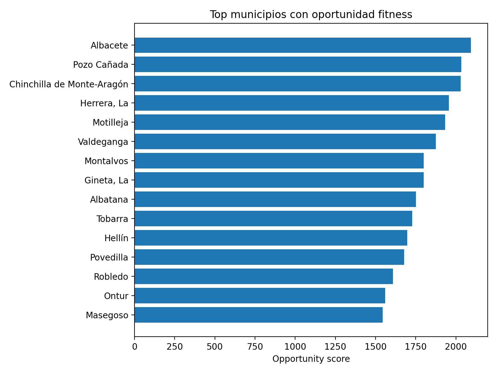

# Gym Market Opportunity Analysis — Albacete

Proyecto de Data Science para identificar oportunidades de abrir gimnasios en la provincia de Albacete utilizando:

- datos demográficos
- renta municipal
- oferta real de gimnasios
- machine learning
- análisis geoespacial

# Análisis de oportunidades para abrir gimnasios en Albacete

Proyecto de Data Science orientado a identificar municipios con potencial para abrir nuevos gimnasios en la provincia de Albacete.

El análisis combina datos demográficos, renta municipal, oferta actual de gimnasios, machine learning y visualización geoespacial.

---

## Objetivo

Identificar municipios donde exista **demanda potencial de gimnasios pero baja oferta actual**, ayudando a detectar oportunidades de negocio en el sector fitness.

---

## Datos utilizados

El proyecto utiliza varias fuentes de datos:

- Datos de población por municipio (INE)
- Datos de renta municipal (IRPF)
- Datos de gimnasios obtenidos mediante Google Places API

---

## Técnicas utilizadas

- Análisis exploratorio de datos
- Feature engineering
- Machine Learning
- Análisis geoespacial
- Visualización de datos

---

## Estructura del proyecto
data/ → datos del proyecto
data/raw/ → datos originales
data/processed/ → datos procesados

notebooks/ → análisis exploratorio y modelado

src/ → scripts reutilizables

reports/ → visualizaciones y mapas

models/ → modelos entrenados

---

## Estado del proyecto

Actualmente el proyecto incluye:

- dataset integrado
- feature engineering
- modelo predictivo
- análisis demográfico
- clasificación de mercados
- visualizaciones
- mapas interactivos
## Visualizaciones del análisis

### Oportunidad vs crecimiento demográfico

### Municipios con mayor oportunidad fitness

## Cómo ejecutar el proyecto

1. Clonar el repositorio

git clone https://github.com/juancmogordoy1/gym-market-analysis-albacete.git

2. Instalar dependencias

pip install -r requirements.txt

3. Abrir los notebooks

notebooks/

## Visualizaciones del análisis

### Oportunidad fitness vs crecimiento demográfico

Este gráfico muestra la relación entre crecimiento poblacional y oportunidad de mercado fitness.

---

### Municipios con mayor oportunidad

Ranking de municipios con mayor potencial para abrir nuevos gimnasios.

